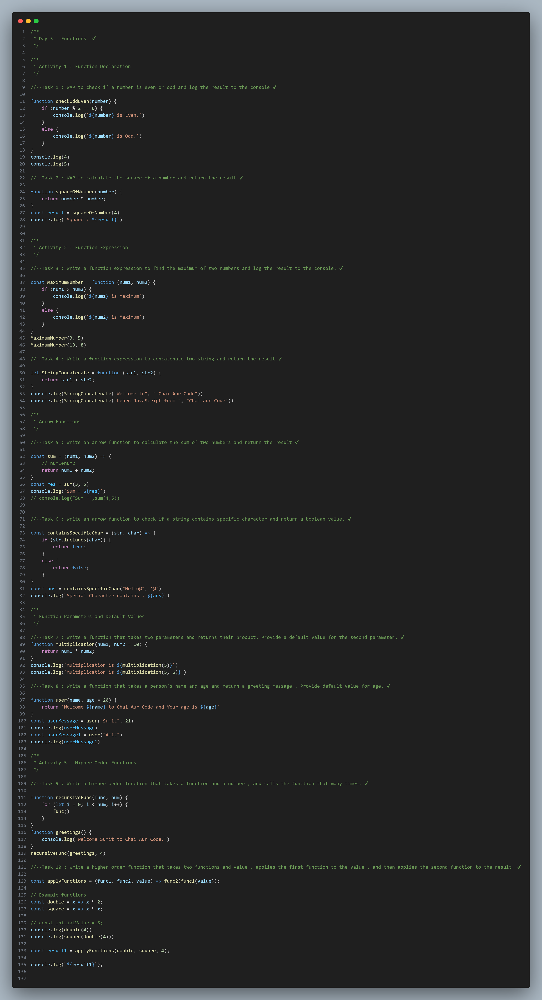

# 30_Days_of_JavaScript_Challenge

# Day 5 :-

# Tasks | Activities 🌟

# Activity 1: Function Declaration
    -- Task 1: Write a function to check if a number is even or odd and log the result to the console.
    -- Task 2: Write a function to calculate the square of a number and return the result.

# Activity 2: Function Expression
    -- Task 3: Write a function expression to find the maximum of two numbers and log the result to the console.
    -- Task 4: Write a function expression to concatenate two strings and return the result.

# Activity 3: Arrow Functions
    -- Task 5: Write an arrow function to calculate the sum of two numbers and return the result.
    -- Task 6: Write an arrow function to check if a string contains a specific character and return a boolean value.

# Activity 4: Function Parameters and Default Values
    -- Task 7: Write a function that takes two parameters and returns their product. Provide a default value for the second parameter.
    -- Task 8: Write a function that takes a person's name and age and returns a greeting message. Provide a default value for the age.

# Activity 5: Higher-Order Functions
    -- Task 9: Write a higher-order function that takes a function and a number, and calls the function that many times.
    -- Task 10: Write a higher-order function that takes two functions and a value, applies the first function to the value, and then applies the second function to the result.

# Feature Request 🙇‍♂
    -- Even or Odd Function Script: Write a script that includes a function to check if a number is even or odd and logs the result.

    -- Square Calculation Function Script: Create a script that includes a function to calculate the square of a number   and returns the result.

    -- Concatenation Function Script: Write a script that includes al function expression to concatenate two strings and returns the result.

    -- Sum Calculation Arrow Function Script: Create a script that includes an arrow function to calculate the sum of two numbers and returns the result.

    -- Higher-Order Function Script: Write a script that includes a higher-order function to apply a given function multiple times.

# Achievement 🏆
By the end of these activities, you will:

    -- Understand and define functions using function declarations, expressions, and arrow functions.
    -- Use function parameters and default values effectively.
    -- Create and utilize higher-order functions.
    -- Apply functions to solve common problems and perform calculations. 
    -- Enhance code reusability and organization using functions.