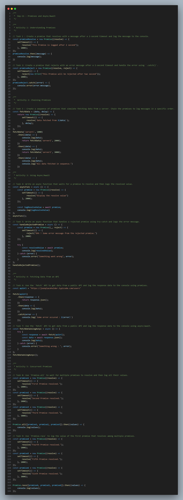

# 30_Days_of_JavaScript_Challenge

# Day-11 : Promises and Async/Await 🍵

## Tasks | Activities 

**Activity 1: Understanding Promises**

**Task 1:** Create a promise that resolves with a message after a 2-second timeout and log the message to the console.

**Task 2:** Create a promise that rejects with an error message after a 2-second timeout and handle the error using `.catch()`.

**Activity 2: Chaining Promises**

- **Task 3:** Create a sequence of promises that simulate fetching data from a server. Chain the promises to log messages in a specific order.

**Activity 3: Using Async/Await**

**Task 4:** Write an async function that waits for a promise to resolve and then logs the resolved value.

**Task 5:** Write an async function that handles a rejected promise using try-catch and logs the error message.

**Activity 4: Fetching Data from an API**

**Task 6:** Use the `fetch` API to get data from a public API and log the response data to the console using promises.

**Task 7:** Use the `fetch` API to get data from a public API and log the response data to the console using async/await.

**Activity 5: Concurrent Promises**

**Task 8:** Use `Promise.all` to wait for multiple promises to resolve and then log all their values.

**Task 9:** Use `Promise.race` to log the value of the first promise that resolves among multiple promises.

### Feature Request 

1. **Promise Creation Script:** Write a script that demonstrates creating and handling promises, including both resolved and rejected states.

2. **Promise Chaining Script:** Create a script that chains multiple promises and logs messages in a specific sequence.

3. **Async/Await Script:** Write a script that uses async/await to handle promises and includes error handling with try-catch.

4. **API Fetch Script:** Create a script that fetches data from a public API using both promises and async/await, and logs the response data.

5. **Concurrent Promises Script:** Write a script that uses Promise all and Promise.race to handle multiple promises concurrently and logs the results.

### Achievement 🏆

By the end of these activities, you will:

- Understand and create promises, including handling resolved and rejected states.

- Chain multiple promises to perform sequential asynchronous operations.

- Use async/await to handle asynchronous code more readably.

- Fetch data from public APIs using both `promises` and async/await.

- Manage multiple concurrent promises using `Promise.all` and `Promise.race`.