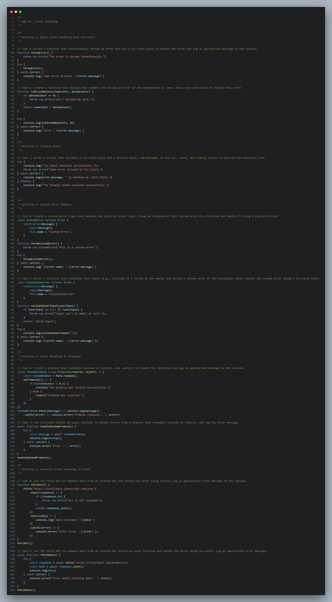

### 30_Days_of_JavaScript_Challenge

### Day-12 : Error Handling 

## Tasks | Activities 

_**Activity 1: Basic Error Handling with Try-Catch**_

- **Task 1:** Write a function that intentionally throws an error and use a try-catch block to handle the error and log an appropriate message to the console.

- **Task 2:** Create a function that divides two numbers and throws an error if the denominator is zero. Use a try-catch block to handle this error.

_**Activity 2: Finally Block**_

- **Task 3:** Write a script that includes a try-catch block and a finally block, Log messages in the try, catch, and finally blocks to observe the execution flow.

_**Activity 3: Custom Error Objects**_

- **Task 4:** Create a custom error class that extends the built-in Error class, Throw an instance of this custom error in a function and handle it using a try-catch block

- **Task 5:** Write a function that validates user input (e.g., checking if a string is not empty) and throws a custom error if the validation fails. Handle the custom error using a try-catch block.

_**Activity 4: Error Handling in Promises**_

- **Task 6:** Create a promise that randomly resolves or rejects. Use `.catch()` to handle the rejection and ing an appropriate message to the console.

- **Task 7:** Use try-catch within an async function to handle errors from a promise that randomly resolves or rejects, and log the error message.

_**Activity 5: Graceful Error Handling in Fetch**_

- **Task 8:** Use the `fetch` API to request data from an invalid URL and handle the error using catch() Log an appropriate error message to the console.

- **Task 9:** Use the `fetch` API to request data from an invalid URL within an async function and handle the error using try-catch. Log an appropriate error message.

### Feature Request 

1. **Basic Error Handling Script:** Write a script that demonstrates basic error handling using try-catch and finally blocks.

2. **Custom Error Script:** Create a script that defines and throws custom error, handling them with try-catch blocks.

3. **Promise Error Handling Script:** Write a script that handles errors in promises using `.catch()` and try-catch within async functions.

4. **Fetch Error Handling Script:** Create a script that handles errors when using the `fetch` API to request data from invalid URLs.

### Achievement 🏆

By the end of these activities, you will:

- Understand and implement basic error handling using try-catch blocks.
- Use finally blocks to execute code regardless of the try-catch outcome.
- Create and use custom error classes.
- Handle errors in promises using `.catch()` and within async functions using try-catch.
- Implement graceful error handling when making network requests with the `fetch` API.