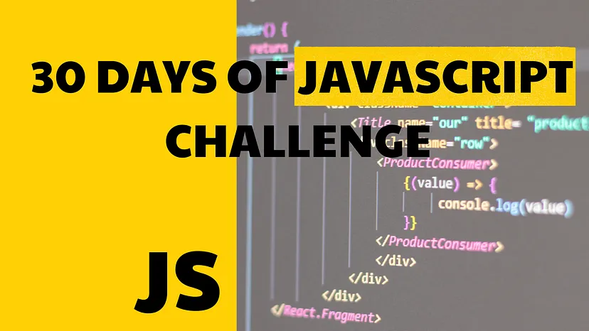

### 30-Days_JavaScript_Challange🚀🍵

## **Instructor - Hitesh Choudhary sir🙇‍♂️**

- **Connect with me** - [LinkedIn😎](https://www.linkedin.com/in/sumitgorai01/)

### _[30 Days Of JavaScript Challenge](https://courses.chaicode.com/learn/batch/30-days-of-Javascript-challenge) by [Hitesh Choudhary](https://www.linkedin.com/in/hiteshchoudhary/) Founder of [ChaiAurCode](https://courses.chaicode.com/learn). This Repository Includes  of 30 Days of JavaScript Challenge with Organized manner and detailed Solutions of the challenges._

| Days     | Topics                                                             |
| -------  | --------------------------------------------------------------- |
| Day-00   | [Introduction 📑](./README.md)                                      |
| Day-01   | [Variables and Data Types 🍵👨‍💻](./Day-01_Variable)                 |
| Day-02   | [Operators 🍵👨‍💻](./Day-02_Operators)                               |
| Day-03   | [Control Structures 🍵👨‍💻](./Day-03_Control_Structure)              |
| Day-04   | [Loops 🍵👨‍💻](./Day-04_Loops)                                       |
| Day-05   | [Functions 🍵👨‍💻](./Day-05_Functions)                               |
| Day-06   | [Arrays 🍵👨‍💻](./Day-06_Arrays)                                     |
| Day-07   | [Objects 🍵👨‍💻](./Day-07_Objects)                                   |
| Day-08   | [ES6+ Features 🍵👨‍💻](./Day-08_ES6_Features)                        |
| Day-09   | [DOM Manipulation 🍵👨‍💻](./Day-09_DOM_Manipulation)                 |
| Day-10   | [Event Handling 🍵👨‍💻](./Day-10_Event_Handling)                     |
| Day-11   | [Promises and Async/Await 🍵👨‍💻](./Day-11_Promises_async_await)     |
| Day-12   | [Error Handling 🍵👨‍💻](./Day-12_Error_Handling)                     |
| Day-13   | [Modules 🍵👨‍💻](./Day-13_Modules)                                   |
| Day-14   | [Classes 🍵👨‍💻](./Day-14_Classes)                                   |
| Day-15   | [Closures 🍵👨‍💻](./Day-15_Closures)                                 |